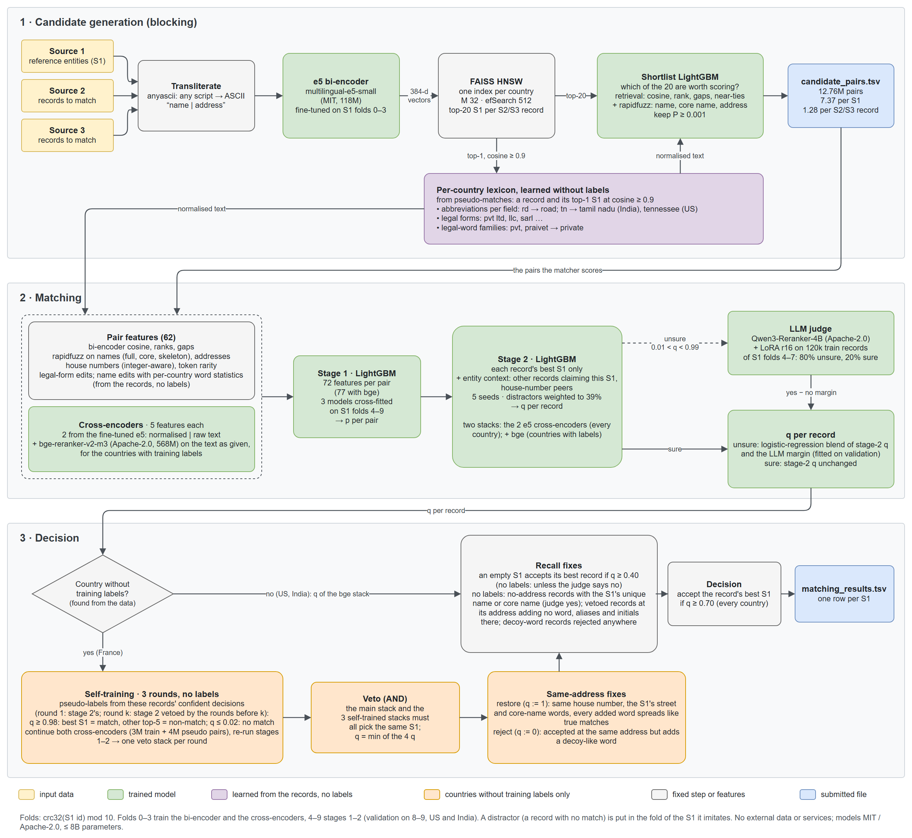

# Business Entity Resolution: Amazon ML Challenge 2026

Team SSM's solution to the Amazon ML Challenge 2026 business entity resolution task: link every noisy business
record from two sources to the one reference business it describes, or to none.

**Top 10 out of 32,000+ teams**, and selected to present the solution to a jury of Amazon Applied Scientists.

| Metric | Score |
|---|---|
| Final ranking | **Top 10** of 32,000+ teams |
| Public leaderboard, macro F0.5 (US / India / France) | **0.990934** |
| Validation, macro F0.5 (US / India, held-out entities) | **0.9930** |
| Candidate pairs per reference entity | **7.37** (1.28 per record) |

## The task

- **Source 1 (S1):** a clean reference list of businesses (1.73M in test).
- **Sources 2 and 3:** 9.97M noisy records in test: typos, transliterated or Indic-script names, changed legal
  forms, shuffled or empty addresses, web-domain names, made-up aliases, and decoys built to look like a real
  business.
- **Countries:** US and India in train; the test set adds France, which has no training labels.
- **Score:** F0.5 per S1 entity, averaged over all entities, so precision counts twice as much as recall.

## Approach



Each S2/S3 record belongs to at most one S1 entity, so every record is resolved on its own: find its best S1 in a
small learned candidate set, then accept or reject that one link.

1. **Blocking.** Every script is transliterated to ASCII with `anyascii`, and a per-country lexicon of abbreviations
   and legal forms is learned without labels. A fine-tuned `multilingual-e5-small` bi-encoder and a FAISS HNSW index
   per country retrieve the top 20 S1s per record. A calibrated LightGBM shortlist keeps 99.4% of true S1s with 7.37
   candidate pairs per S1.
2. **Matching.** 72 features per pair (name, address, integer-aware house numbers, legal-form edits) plus e5 and
   `bge-reranker-v2-m3` cross-encoders feed LightGBM stage 1. Stage 2 re-scores each record's best S1 with entity
   context: the other records claiming the same S1, and those at the same house number, so decoys compete with the
   entity's true cluster. A LoRA-tuned `Qwen3-Reranker-4B` judges only the unsure records.
3. **Decision.** France gets three self-training rounds used only as a veto, plus label-free statistics of where
   decoys sit relative to the S1's address. Recall fixes then fill entities left empty, and a single threshold
   (q ≥ 0.70) applies to every country.

No external data, APIs or hand-written word lists are used. Countries without labels are detected from the data;
the code names no country.

The full write-up, with design decisions, ablations, error analysis and the leaderboard history, is in
[Documentation.md](Documentation.md). The data analysis behind it is in [EDA.md](EDA.md).

## Repository layout

```
.
├── code/business_entity_resolution/
│   ├── reproduce.sh          # single entry point: runs every step end to end
│   ├── requirements.txt      # pinned dependencies
│   ├── README.md             # step-by-step pipeline description
│   └── src/                  # 23 modules (blocking, features, cross-encoders, stages 1-2, LLM judge, fixes)
├── eda/                      # exploratory analysis scripts (quick pass and deep pass)
├── Documentation.md          # solution write-up
├── EDA.md                    # data analysis findings
└── pipeline.png              # pipeline diagram
```

## Reproducing the submission

**Data.** Place the challenge's `student_resource/` folder, unchanged, at the repository root. The code expects
`student_resource/dataset/{train,test}`. The data is not part of this repository.

**Environment.**

```bash
conda create -n amlc python=3.12 -y && conda activate amlc
pip install -r code/business_entity_resolution/requirements.txt
```

**Run** from the repository root:

```bash
AMLC_ROOT=$PWD GPU_A=0 GPU_B=1 GPU_C=2 bash code/business_entity_resolution/reproduce.sh
```

- Writes `output/matching_results.tsv` and `output/candidate_pairs.tsv`, then checks them with the organisers'
  validator. Caches, models and logs go to `work/`.
- Takes about 9–10 hours on three A100 80 GB GPUs, ~64 CPU cores and ~250 GB RAM. One GPU also works: `GPU_B` and
  `GPU_C` default to `GPU_A`.
- Each step logs to `work/logs/<step>.log` and leaves a `.done` marker, so a rerun resumes after the last finished
  step.
- The models (`intfloat/multilingual-e5-small`, MIT; `BAAI/bge-reranker-v2-m3` and `Qwen/Qwen3-Reranker-4B`,
  Apache-2.0) download on first use. On an offline machine, point `E5=`, `BGE=` and `LLM=` at local copies.
- GPU training is not bit-deterministic, so a rerun matches the submitted files closely but not byte for byte.
  See the code [README](code/business_entity_resolution/README.md) for the measured differences.

## Team

Sahaj Mistry, Sarvesh Nikas, Mohanish Baviskar
