# Architecture: `v10_fr3_llm_dd` (Amazon ML Challenge 2026, business entity resolution)

**Leaderboard 0.990282** (public LB, 2026-09-27). The task: match every Source-2 / Source-3 business record to the
Source-1 entity it belongs to, or to none, scored by macro F0.5 over the Source-1 entities (S1). Train has labels for
the US and India; test adds France, which has no labels anywhere.

This document covers the whole design, why each piece exists, what each piece measurably added, and what did not
work, so you can pick what fits your own pipeline. The numbers are from our validation and leaderboard runs.

---

## 1. The key framing

From the train ground truth: **every S2/S3 record belongs to at most one S1** (7.6M matched ids, none reused). About
26% of train records match nothing ("distractors"); test has about 39%. On average an S1 has 3.46 true records, with
the same distribution in the US and India.

So the problem is solved **record by record**: *for each S2/S3 record, which S1 is it, if any?*
- Take the record's best candidate S1.
- Re-score it with context about the other records claiming the same S1.
- Accept it if its score ≥ a threshold.

Nothing is clustered, and there is no pairwise transitivity to enforce.

## 2. Pipeline

```mermaid
flowchart LR
  A[raw records] --> B[normalise<br/>transliterate + learned per-country lexicon]
  B --> C[bi-encoder<br/>multilingual-e5-small, fine-tuned]
  C --> D[HNSW top-20<br/>same country]
  D --> E[calibrated shortlist<br/>LightGBM, P >= 0.001]
  E --> F[pair features<br/>fuzzy, numbers, name edits]
  E --> G[2 cross-encoders<br/>e5-small, norm + raw text]
  F --> H[stage 1 LightGBM<br/>cross-fitted]
  G --> H
  H --> I[stage 2 LightGBM<br/>entity context + house-number peers]
  I --> J[LLM judge blend<br/>Qwen3-Reranker-4B LoRA, unsure rows]
  J --> K[threshold 0.70]
  K --> L[France: self-training vetoes x3]
  L --> M[France: same-address census fixes]
  M --> N[matching_results.tsv]
```

| # | Step | What it does | Measured value |
|---|---|---|---|
| 1 | Normalise | anyascii transliteration, tokenise, **per-country lexicon learned without labels** | removes all hand-written tables |
| 2 | Blocking | fine-tuned e5-small + FAISS HNSW + calibrated shortlist | 99.39% of true S1s kept at 1.25 candidates per record |
| 3 | Pair features | ~70 features: fuzzy names / addresses, numbers, legal forms, name edits | base of the stack |
| 4 | Cross-encoders | two e5-small CEs on the retrieved pairs | v4 → v5: validation +0.004 |
| 5 | Stage 1 | LightGBM on features + CE scores, cross-fitted | |
| 6 | Stage 2 | best candidate re-scored with entity context and house-number peers | peers: +0.00025 val |
| 7 | LLM judge | 4B reranker LoRA, blended into unsure rows | +0.0002 val, **+0.001 LB** (mostly France) |
| 8 | Decision | one threshold (0.70) for every country | |
| 9 | France vetoes | 3 self-training rounds, used only as an AND-veto | **+0.0034 LB** in total |
| 10 | France census fixes | label-free restore / reject at the S1's own address | **+0.0032 LB** |

### Step 1: normalisation, learned rather than hand-written
- `anyascii` transliterates every script to ASCII (Devanagari, Telugu, accents…), then lowercase and tokenise.
  Single letters separated by dots or spaces join into one token (`L.L.C.` → `llc`), and letters glued to a number
  are split off (`N°29` → `ndeg 29`).
- **Per-country lexicon from pseudo-matches:** a record and its top retrieved S1 at cosine ≥ 0.9, no labels needed.
  - Abbreviations: a short token that is a letter subsequence or the initials of the other side, frequent,
    unambiguous in that country, and ≥ 2 letters shorter (so typos aren't learned). This learns `tn` = Tennessee in the
    US and Tamil Nadu in India, and `r` = rue, `bd` = boulevard in France.
  - Legal forms: words near the end of S1 names that matching records drop far more often than other words. It learns
    llc / inc / corp (US), limited / ltd / private plus ~90 misspellings (India), and sa / sarl / sas / sasu / sci (France).
- **Why learned:** country is an open set, and the same token means different things in different countries.

### Step 2: blocking
- **Bi-encoder:** `intfloat/multilingual-e5-small` (MIT, 118M), fine-tuned with in-batch negatives on (record, its S1)
  pairs of folds 0-3.
- **Search:** FAISS **HNSW** (M 32, efSearch 512), top-20 S1s of the same country. A query costs about log(#S1),
  ~30 s per 100k queries on 32 CPU cores. It loses only ~0.09 points of recall@20 against exact search. IVF lost 1.4
  points; avoid it.
- **Calibrated shortlist:** a small LightGBM on retrieval features (cosine, rank, gaps, near-ties, softmax share) plus
  three rapidfuzz similarities per pair (name token-set, core-name ratio, address token-set). It keeps candidates with
  P ≥ 0.001.

| Candidate set | True S1 kept | Candidates per record |
|---|---|---|
| top-5 | 98.95% | 5.00 |
| top-20 | 99.42% | 20.0 |
| gap 0.1 to the best | 99.35% | 1.99 |
| **calibrated + text sims, P ≥ 0.001** | **99.39%** | **1.25** |

The organisers rank smaller candidate sets higher, and blocking recall is the hard ceiling, so this is worth getting
right early.

### Step 3: pair features
- Embedding score, rank and gaps.
- rapidfuzz on full / core / consonant-skeleton names and on addresses.
- Numbers and token rarity. Integer-aware house numbers (`0012` = `12`).
- Legal-form edits, over the learned legal-spelling families.
- Name edits between core names: typo-tolerant words added or dropped, and how alike a swapped pair is. Each word
  also gets per-country statistics from the split's own records.

### Step 4: cross-encoders, which pay off through stacking
Both are trained **only on the retrieved top-5 pairs of folds 0-3**, so wrong-S1 negatives are included:
- e5-small on normalised `name | address`;
- e5-small on raw transliterated text, which keeps punctuation and suffix spellings. It is the best single model:
  0.9829 of records with the right argmax S1.

Alone, a CE is on par with the stage-1 GBM (pair AUC 0.99984 vs 0.99985). Stacked, v4 → v5 gained +0.004 validation.
Each CE contributes its score, its rank within the record, the gap to the next candidate, its rank within the S1, and
the S1's number of positive claims.

### Steps 5-6: two LightGBM stages
- **Stage 1:** pair features + CE features, cross-fitted over folds 4-9 in 3 groups. Each train pair gets the
  out-of-fold probability; test gets the mean of the three models.
- **Stage 2:** only each record's best candidate, re-scored with **entity context**: the other records claiming the
  same S1 (how many above 0.9 / 0.5 / 0.2, their sum and max, the record's rank, same-source claims).
- **House-number peers:** a distractor entity's records share its altered house number (an S1 at 14 Rue X has its
  decoys at 15). So stage 2 also sees the other claimants at the same first number: how many, their best and summed
  probability, and how many distinct numbers claim the S1.
- **Weight distractors, don't copy them.** Test has 39% distractors against 26% in train. Repeating distractors to match
  creates identical twins test never has, and inflated our validation by 0.0016. Each distractor appears once with
  weight 3.04.
- 5 seeds averaged.

### Step 7: LLM judge (the only multilingual "reader")
- **Model:** `Qwen/Qwen3-Reranker-4B` (Apache-2.0, 4.0B parameters; Qwen3-8B is 8.19B, over the 8B limit).
- **Training:** LoRA r 16 on 120k train records whose stage-1 probability is unsure. The score is
  logit(yes) − logit(no) on raw text.
- **Use:** on the unsure rows (0.01 < q < 0.99), a logistic regression of the label on [logit q, LLM margin], fitted on
  validation, replaces q.
- **Result:** weaker alone (AUC 0.844 vs 0.936 for stage 2) but complementary: +0.0002 validation, **+0.001 LB**. Five
  times the validation gain, so mostly France: it reads French decoys that models trained on US / India text cannot.
- A zero-shot 7B judge did nothing (AUC 0.59). The LoRA fine-tune is what makes it work.

### Step 8: decision
Accept a record if its final q ≥ 0.70, the same threshold for all countries. An expected-F0.5 decision per S1 did worse
than a plain threshold.

### Step 9: France, part 1: self-training used only as a veto
- The CEs are continued on France test pairs whose decision was confident:
  - q ≥ 0.98: the best S1 is a match, the other candidates non-matches (a record has at most one S1);
  - q ≤ 0.02: all its candidates are non-matches.
- These are mixed with train pairs so the US / India don't drift, and the stacks are rebuilt.
- **Used only as an AND-veto:** a France record is accepted only if the base stack *and* the self-trained stack accept
  it for the same S1. The self-trained stack's new rejections were ~80% decoys, but its new acceptances ~45% decoys
  (confirmation bias: "same address, so same entity").
- 3 rounds, each seeded by the previous file: LB +0.00205, +0.0012, +0.000135. Diminishing: stop after 2-3.

### Step 10: France, part 2: the same-address census fixes (+0.0032 LB)
The biggest single gain, found by hand-reviewing ~180 France entity groups and turning the patterns into label-free
statistics.

1. **France's contested records sit at the S1's own house number.** Test rows per S1 at the same number: France 3.32,
   US 2.73, India 2.74. France true matches carry very little house-number noise.
2. **The census.** Each S1 gets a roughly fixed number of decoys, normally at one shifted number D. A decoy placed at
   the S1's *own* address therefore leaves that S1's shifted cluster short.
   - Let nD = the S1's records at other house numbers.
   - For every word w that records add at the same address, compare the nD distribution of those records with that of
     unedited same-address records (total variation distance, TV).
3. **Validated on labels:** words with TV ≤ 0.1 are 98.7% (US) and 90.8% (India) true at the same address. Words with
   TV ≥ 0.2 are 22.5% true (India), and 0% for TV > 0.3.
4. **On France:**
   - *true-like:* & Fils, & Associés, & Cie, Services, Groupe, Développement, France, plus DBA / alias / initials /
     `.com`. The models were rejecting 67-99% of fils / associés / groupe / développement / france.
   - *decoy-like:* type-word swaps at the same address (Club → École, Amicale → Comité…), the France "different business
     in the same building" decoy. The models accepted these arbitrarily by word: comité 72%, pharmacie 0%, because
     French words that resemble US filler words (comité, fédération, société, centre) looked harmless.
5. **Action:**
   - restore 32,439 rejected same-address records whose added words are all true-like;
   - reject 11,655 accepted same-address records adding a decoy-like word.
   - The restore candidates must also pass a strict same-address rule: same first number (bis / ter included), same
     compound sub-number, the S1's distinctive street words, the same first core-name word, and the S1's rarest
     core-name word.
6. An earlier restore that ignored the word split lost 0.00125 on the LB. The two-family split predicted that loss
   exactly (59% vs 57.5% true).

## 3. Folds and validation (what makes validation trustworthy)
- **S1 folds:** `crc32(S1 id) % 10`.
  - 0-3 train the bi-encoder and the CEs.
  - 4-9 train stages 1-2, cross-fitted.
  - 8-9 validate stage 2 (fit on 4-7), and the final model is refit on 4-9.
- **Distractor fold:** each distractor takes the fold of the S1 it imitates (its top-1 retrieved S1), not a hash of its
  own id. Otherwise training / validation entities lose ~40% of their decoys (0.73 vs 1.22 per S1). +0.0001 validation,
  and a harder, more honest validation set.
- **Test-like validation:** distractors weighted to the test share (39%), each appearing once. Copies inflate the score.
- **Moving folds between blocks doesn't help:** stage 1 with 4 folds per model scored 0.99241, with 5 folds 0.99234
  (saturated). The CE and LLM blocks are limited by GPU time, not by folds.

## 4. How the data is generated (as far as we could reverse-engineer it)
- **Distractors (hard negatives)**, about 1.2 per S1 in train and ~2 in test. One edit to the S1 name, with the house
  number shifted **up** by 1-13: 99.4% upward in the US, 92% in India. True-match number noise goes both ways.
  - One per-country decoy word list:
    - US: holdings, group, partners, ltd + place words (northside, midtown, valley…);
    - India: enterprises, industries, ventures, exports, overseas, infratech, public…;
    - France: participations, distribution, holding, international, groupe, développement, france, snc.
  - Other decoy edits: a type-word swap, a legal-form swap, a small edit to the distinctive first word.
  - All decoys of one S1 usually share **one** shifted number.
- **True-match noise:** typos, word reordering, dropped words, legal-form changes (~26%), filler suffixes, DBA / alias
  names ("Calotavo Labs a/k/a …", or just the made-up alias alone at the same address), initials ("FC"), web-style names
  (`name.com`), zero-padded numbers, ±1-10 house-number noise (US / India only), and empty addresses.
  - US filler suffixes: Center, Services, Commission, Federation, Partners.
  - France filler suffixes: & Fils, & Associés, & Cie, Services, Groupe, Développement, France.
  - Some words are in **both** lists (US "partners", France "groupe / développement / france"). Their meaning depends
    on where the record sits: at a shifted number a decoy, at the S1's own address filler noise.
- **Country-specific decoy placement:**
  - India decoys often keep the first number and change a sub-number (plot / floor numbers).
  - France has same-address type-swap decoys.
  - The US almost never places decoys at the S1's address (3.7% of decoys).
- **The irreducible part (validation ceiling ~0.9985):** records with no address whose full name equals their S1's
  *and* another S1's (0.5% of validation records). Only weak signals separate them, e.g. whether the exact name also
  appears among the S1's addressed records.

## 5. Leaderboard progression

| Version | Change | Validation (US/India) | LB |
|---|---|---|---|
| v4 | pair features + stage 1 + entity-context stage 2 | 0.9886 (with copies) | 0.9672 |
| v7w | + 3 cross-encoders, distractors weighted (no copies) | 0.99240 | 0.98264 |
| v8 | HNSW + calibrated shortlist, learned lexicon, no hand-written tables | 0.99236 | – |
| v9p | shortlist with text similarities, house-number peers, 5 seeds | 0.99277 | 0.98269 |
| v9p_frand | + France self-training veto (round 1) | = | 0.98474 |
| v10_fr2 | distractors in their imitated S1's fold; veto round 2 | 0.99285 | 0.98594 |
| v10_fr3 | veto round 3 | = | 0.98608 |
| v10_fr3_llm | + LLM judge blend | 0.99282 | 0.98707 |
| **v10_fr3_llm_dd** | **+ France same-address census fixes** | = | **0.99028** |

A useful probe: leave one country's S1s empty and upload. An empty S1 scores 1 only if it truly has no match (~5.5%),
so the score difference isolates that country: France ≈ (full − probe) / share + 0.055. France is 14.975% of S1s, so
any France-only change reads as LB delta / 0.15 on France.

## 6. What did not work (so you can skip it)
- Word-edit log-likelihood features: 0.99274 vs 0.99273. The CEs already know the decoy words.
- A hand-written "shifted house number shared with another claimant" veto. It looked right on test samples, but on
  validation it rejected accepted rows that were **99.6% true** (US 0.99277 → 0.99074). **Check any rule on labelled
  data before trusting eyeballed test samples.**
- Taking every France decision from the self-trained stack instead of using it as a veto.
- Six stage-1 fold groups instead of three; per-bucket thresholds; re-ranking the top 2 candidates; an expected-F0.5
  decision per S1.
- A zero-shot 7B LLM judge (AUC 0.59).
- LightGBM + XGBoost judge ensembles: ~0.
- Continuing the LLM on France pseudo-labels: it copied the vetoes' decisions (confirmation bias).
- bge-reranker-v2-m3 as a third CE: +0.00016 validation. Small; it's in our next candidate (v10b), not in this file.
- Restoring France records by a same-address rule tuned on the US / India (−0.00125 LB): France has a decoy type the
  labelled countries don't. The census split fixed exactly this.
- Using the "matches per S1" histogram as a France target: a restore matched the train shape and still lost.

## 7. Lessons that transfer
1. **Assign each record to at most one S1, then use entity context** (stage 2 over all claimants of an S1). Most of the
   gain over a plain pair classifier comes from there.
2. **Blocking is the ceiling.** A calibrated shortlist beats a fixed top-k: same recall, 4x fewer pairs.
3. **Make validation look like test:** distractor share, no duplicated negatives, distractors in their entity's fold.
4. **Cross-encoders and LLMs add value when stacked**, not as standalone classifiers. For the country without labels, a
   multilingual reader (LLM) and self-training *as a veto* are what moved the score.
5. **F0.5 favours precision.** Removing a record breaks even at only ~25-30% decoys, while adding one needs ~70% true.
   Reject aggressively and restore carefully.
6. **For a country without labels, look for label-free structure the generator can't hide.** Here it was where decoys
   sit (shifted number vs same address) and how an S1's decoy count is split between them. Validate the statistic on
   the labelled countries first, then spend one LB upload to confirm.

## 8. Compute and licences
- One A100 80GB, ~32 CPU cores, ~200 GB RAM.
  - End to end ~12 h: bi-encoder ~10 min; retrieval + lexicon + shortlist ~2 h; features + CEs + stages ~4.5 h;
    self-training rounds ~1.5 h each.
  - LLM LoRA: ~1 h to train; ~150 pairs/s to score, 0.5-1 h on the unsure rows.
- Models: `intfloat/multilingual-e5-small` (MIT), `Qwen/Qwen3-Reranker-4B` (Apache-2.0, 4.0B), all offline and
  fine-tuned only on the provided data. Libraries: LightGBM, FAISS (HNSW), rapidfuzz, anyascii, transformers + peft.
- No external data, APIs or lookups. Every statistic on the test records is unsupervised; self-training uses only the
  pipeline's own confident decisions.
