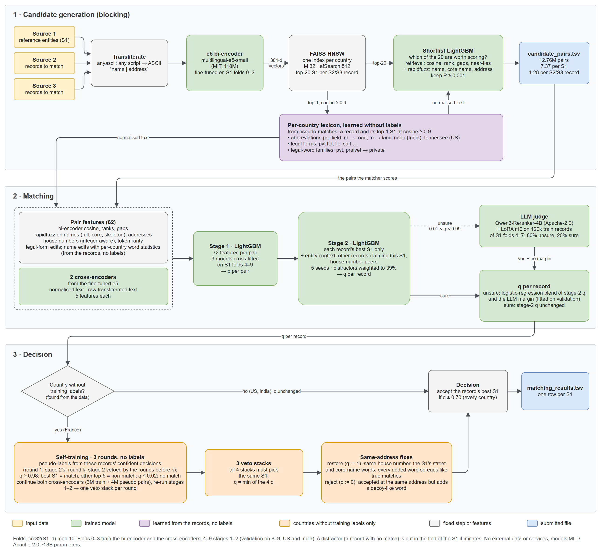

# ML Challenge 2026: Business Entity Resolution Solution

**Team Name:** SSM  
**Team Members:** Sahaj Mistry, Sarvesh Nikas, Mohanish Baviskar  
**Submission Date:** 27 September 2026

---

## 1. Executive Summary

We resolve every Source 2 / Source 3 record on its own: find its best Source 1 (S1) entity in a small learned
candidate set, then accept or reject that one link with models that also see every other record claiming the same
entity. Blocking uses a fine-tuned multilingual bi-encoder, HNSW search and a calibrated LightGBM shortlist. It produces
7.37 candidate pairs per S1 and keeps 99.98% of the true pairs that retrieval finds. Matching stacks two LightGBM
stages over 62 pair features and two cross-encoders, and a LoRA-tuned 4B reranker judges the unsure records. France has
no training labels, so it gets three self-training rounds, used only as vetoes, and label-free fixes derived from how
the data places decoys at house numbers. Macro F0.5 is **0.99282 on US / India validation** and **0.990349 on the
public leaderboard**.

---

## 2. Methodology

### 2.1 Problem Analysis

We measured these on the provided files (train: US and India; test: US, India and France).

| Finding | Evidence | What we did with it |
|---|---|---|
| Each S2/S3 record belongs to **at most one** S1, and country always agrees | 7,638,365 train pairs, no record id reused; 100% of pairs share the country | Solve record by record (one S1 or none); block within a country, which loses no true pair |
| **The address decides, not the name** | 39% of S1 entities share their normalised name with another S1 (up to 253 "Primary Care Group"); same-name different businesses have address similarity ~33 vs ~94 for true matches | Address, house-number and namesake-count features; entity context in stage 2 |
| **Distractors are hard negatives**, and test has more of them | 26% of train S2/S3 records match nothing (~1.2 per S1); ~39% in test (estimated from score distributions, a method that recovers the train rate exactly) | Validation weights distractors to 39%, each appearing once (copies inflated validation by 0.0016) |
| **How decoys are made** | One edit to the S1 name (an added word such as *holdings* / *enterprises* / *participations*, or a type-word, legal-form or first-word swap), with the house number shifted **up** by 1–13 (99.4% of US and 92% of India decoys; true-match number noise goes both ways). One S1's decoys usually share one shifted number | Integer-aware house-number features; stage-2 "peers" at the same number; for France, statistics of where records sit relative to the S1's address (§4) |
| **True matches are noisy** | Legal form changed ~25%, typo-like edits 16%, word added 9% / dropped 5% / reordered 6%, empty address 4.4%, web-domain names 4.4% (`familybrighthealth.com`), made-up alias names 1.8%, zero-padded or truncated numbers; India S2 names 23% in an Indic script | `anyascii` transliteration; abbreviations and legal forms learned per country; cross-encoders on raw text; integer-aware numbers |
| **Postcodes are rare** | US ZIP in ~10% of addresses, Indian PIN ~1%, French code postal 0.5% | Not usable as a blocking key, so blocking uses a learned embedding |
| **France has no labels** | 14.975% of test S1s (its weight in the macro score), 1.43M records to match; no France record in train | Self-training on the pipeline's own confident decisions plus label-free statistics. Country is treated as an open set: countries without labels are found from the data, and the code names no country |
| **What is left is information-limited** | Most remaining errors are records with an empty address whose name belongs to several S1s (§5) | Precision-first threshold (F0.5) |

### 2.2 Solution Strategy

**Approach Type:** Hybrid: learned blocking (bi-encoder + ANN + calibrated shortlist) → stacked classifiers (LightGBM
+ cross-encoders + LLM judge) → label-free adaptation for the country without labels.  
**Core Innovation:**

1. **Entity context:** stage 2 re-scores each record's best S1 using the other records that claim the same S1 and the
   same house number, so decoys compete with the entity's true cluster.
2. **A country without labels, handled without hand-written rules:** self-training that can only *remove* matches (an
   AND-veto), and a label-free "census" of decoy placement that decides same-address records. Both were validated on
   the labelled countries before use.



*Figure: the full pipeline. Green = trained model, purple = learned from the records without labels, orange = applied
only to countries without training labels, blue = submitted files.*

Principles that held throughout:

- **Validation looks like test.** Folds are `crc32(S1 id) % 10`. Folds 0–3 train the bi-encoder and cross-encoders;
  4–9 train stages 1–2, and validation uses entity folds 8–9 fitted on 4–7. Distractors are weighted to 39%, and each
  distractor sits in the fold of the S1 it imitates, so an entity keeps all its decoys.
- **Nothing is hard-coded to a country.** There are no state tables or word lists. Abbreviations, legal forms and
  word statistics are learned from the provided records, and no external data or services are used.
- **Every rule is checked on labelled data first.** One rule that looked right on eyeballed test records turned out to
  reject 99.6%-true matches on validation (Appendix B).

---

## 3. Candidate Generation (Blocking)

- **Blocking keys used:** no hand-crafted keys. Candidates come from a learned dense key:
    1. **Normalise:** `anyascii` transliterates every script to ASCII, then lowercase and tokenise. Dotted letters join
       (`L.L.C.` → `llc`) and letters glued to numbers split off (`N°29` → `ndeg 29`). A **per-country lexicon** is
       learned without labels from pseudo-matches (a record and its top retrieved S1 at cosine ≥ 0.9). It covers
       abbreviations (`tn` = Tamil Nadu in India, Tennessee in the US; `r` = rue, `bd` = boulevard in France), legal
       forms (llc / inc, private / limited plus ~90 misspellings, sarl / sas / sci) and legal-word families
       (`pvt`, `praivet` → private).
    2. **Bi-encoder:** `intfloat/multilingual-e5-small` (MIT, 118M), fine-tuned with in-batch negatives on
       (record, its S1) pairs of S1 folds 0–3, over `name | address`.
    3. **Search:** FAISS **HNSW** (M 32, efConstruction 200, efSearch 512), one index per country, top-20 S1s per record.
       It loses ~0.09 points of recall@20 against exact search; IVF lost 1.4 points.
    4. **Calibrated shortlist:** a LightGBM on 9 retrieval features (cosine, rank, gaps to the best and next, near-tie
       counts, softmax share) and 6 cheap text similarities (rapidfuzz on name, core name and address, and each one's
       gap to the record's best). It keeps candidates with **P ≥ 0.001**.
- **Candidate pairs generated:** **12,760,925** (`candidate_pairs.tsv`) = **7.37 per S1** = **1.28 per S2/S3 record**.
  By country: US 6.6, India 7.2 and France 10.1 per S1, where the extra comes from France's long tail of namesakes.
  All within-country pairs would be 6.72 × 10¹²; the reduction ratio is **99.99981%**.
- **How we ensured true matches were not lost:**
    - The encoder is trained on the actual noise: transliterated Indic names, web-domain names, legal-form changes and
      reordered addresses retrieve their S1 where exact keys would not.
    - Restricting to the same country is lossless, since country always agrees.
    - The shortlist threshold is set for recall and its cost was measured on held-out folds. Table 3.1 gives candidate
      recall and table 3.2 the recall / size / F0.5 trade-off.

**Table 3.1: share of matched records whose true S1 is in the candidate set (held-out train folds, US / India)**

| Candidate set | True S1 kept | Candidates per record |
|---|---|---|
| exact search, top-20 | 99.51% | 20 |
| HNSW top-20 | 99.42% | 20 |
| HNSW top-5 | 98.95% | 5 |
| gap ≤ 0.1 to the best cosine | 99.35% | 1.99 |
| **calibrated shortlist + text similarities, P ≥ 0.001 (used)** | **99.39%** | **1.25** |

**Table 3.2: shortlist threshold vs candidate-set size and final F0.5 (validation: a record whose chosen pair leaves the
set goes unmatched)**

| Blocking | Test pairs per S1 | True pairs kept (val) | Validation F0.5 |
|---|---|---|---|
| **P ≥ 0.001 (used)** | **7.36** | **99.98%** | **0.99262** |
| P ≥ 0.005 | 6.55 | 99.95% | 0.99258 |
| P ≥ 0.01 | 6.27 | 99.91% | 0.99255 |
| P ≥ 0.05 | 5.42 | 99.41% | 0.99216 |
| top 1 per record | 5.60 | 98.71% | 0.99193 |

The shortlist loses 0.03 points of recall against HNSW top-20 while cutting candidates 16×. A tighter set
(P ≥ 0.01, 6.27 per S1) costs only 0.00007 on US / India, but on France it removes the namesake competitors the matcher
relies on: 1,110 France matches were lost because their S1 was pruned, most of them ones the matcher was confident
about. We kept P ≥ 0.001.

---

## 4. Matching Model

**Features used** (72 per pair in stage 1: 45 pair features, 17 edit / number features, 10 cross-encoder features):

- **Name features:**
    - rapidfuzz ratio, token-set, token-sort, partial and Jaro-Winkler on the normalised full name and on the core name
      (legal forms removed);
    - core name without spaces, exact core-name match, and consonant-skeleton similarity;
    - IDF-weighted word Jaccard, the shared IDF, and the most informative unshared word on each side;
    - legal-form bits (added, dropped, xor) over learned legal spelling families;
    - **name edits:** typo-tolerant words added or dropped, the similarity of a swapped word pair, and each added or
      dropped word's per-country statistics from the split's own records;
    - **namesake counts:** how many S1 entities and records share this core name.
- **Address features:**
    - rapidfuzz ratio, token-set and partial on the normalised address, IDF-weighted word Jaccard and unshared words;
    - number tokens: set overlap, partial match, first number equal, ZIP equal;
    - **integer-aware house numbers** (`0012` = `12`): first number equal, the S1's first number found in the record,
      the smallest difference, Jaccard, and numbers on one side only;
    - empty-address and no-number flags.
- **Other:**
    - bi-encoder cosine, rank within the record, gaps to the best and next candidate;
    - the S1's rank for this record, and how many records rank it first;
    - source (S2 / S3), non-ASCII flag, lengths;
    - two **cross-encoders**, each giving 5 features: score, rank within the record, gap to the next, rank within the
      S1, and the S1's number of positive claims.
- **Stage-2 entity context** (on each record's best S1):
    - stage-1 p, the second-best p and their margin;
    - the other records claiming the same S1: how many, how many above 0.9 / 0.5 / 0.2, their sum and max, this
      record's rank, and claims from the same and the other source;
    - **house-number peers:** the claimants at the same first house number (count, max, sum) and the number of distinct
      numbers claiming the S1;
    - 18 key pair features.

**Model type:** a stack of gradient-boosted trees, transformer cross-encoders and an LLM judge.

| Component | Model | Trained on |
|---|---|---|
| Cross-encoders (×2) | e5-small initialised from the fine-tuned bi-encoder, one on normalised text and one on raw transliterated text (the raw one keeps punctuation and suffix spellings) | retrieved top-5 pairs of S1 folds 0–3, so wrong-S1 negatives are included |
| Stage 1 | LightGBM (255 leaves, lr 0.05) on 72 features, cross-fitted in 3 fold groups over folds 4–9 (test = mean of the 3 models) | all candidate pairs |
| Stage 2 | LightGBM on each record's best pair + entity context; distractors weighted to the test share (39%), 5 seeds averaged | folds 4–9 (validated on 8–9 after fitting on 4–7) |
| LLM judge | `Qwen/Qwen3-Reranker-4B` (Apache-2.0, 4.0B) + LoRA (r 16, α 32) on the raw name and address text; score = logit(yes) − logit(no) | 120k best pairs of folds 4–7: 80% with an unsure stage-1 p, 20% sure |
| Judge blend | For unsure records (0.01 < q < 0.99), a logistic regression on [logit q, LLM margin] replaces q | validation rows |
| Self-training (countries without labels) | both cross-encoders continued on 3M train pairs + 4M pseudo-labelled test pairs (q ≥ 0.98: best S1 = match, the record's other top-5 = non-match; q ≤ 0.02: no match), then stages 1–2 rerun. Three rounds: round 1 is seeded by stage 2, round k by stage 2 vetoed by rounds < k | the pipeline's own confident test decisions (no labels) |
| Vetoes | a record of such a country is accepted only if all 4 stacks pick the same S1, at the lowest of their scores | |
| Same-address fixes (countries without labels) | label-free census: each S1 gets a roughly fixed number of decoys, normally at one shifted number, so a decoy placed at the S1's *own* address leaves that shifted cluster short. For every word records add at the S1's address, we compare how many of the S1's records sit at other numbers, between those records and unedited ones (total variation distance TV). **True-like** (TV ≤ 0.10): a structurally matching record (same number and sub-number, the S1's distinctive street words, first and rarest core-name word) adding only such words is restored. **Decoy-like** (TV ≥ 0.20): an accepted same-address record adding one is rejected | the test records' own structure. On US / India validation, TV ≤ 0.10 words are 98.7% / 90.8% true and TV ≥ 0.20 words 22.5% true (India) |

The fixes run only where labels are missing. Where labels exist, the models already get these records right, and the
same fixes would cost India 0.0024 (checked with labels).

**Threshold selection method:** F0.5 optimised on the test-like validation set above (US / India, entity folds 8–9,
39% distractors, no copies). We accept a record's best S1 when **q ≥ 0.70**, one threshold for every country (flat
between 0.65 and 0.70). Separate thresholds per bucket (empty address, namesakes, added / dropped word, source,
singletons) gained +0.00000, and an expected-F0.5 decision per S1 did worse than the plain threshold.

---

## 5. Results & Error Analysis

- **F_0.5 Score (macro):**
    - validation (US / India): **0.99282** with the LLM judge; 0.99262 for stage 2 alone;
    - public leaderboard: **0.990349**.
    - France has no labels. If US / India score on the leaderboard about as on validation, the leaderboard implies a
      France F0.5 of roughly 0.98.

**Where validation F0.5 is lost** (stage 2, threshold 0.70; "gain" = the score if that error type were fixed):

| Error type | Rows | Gain if fixed | With empty address | Namesake S1s (core name shared) |
|---|---|---|---|---|
| Missed true match (false negative) | 8,829 | +0.00208 | 75% | 78% |
| Accepted distractor (false positive) | 524 | +0.00054 | 46% | 49% |
| Accepted the wrong S1 (false positive) | 741 | +0.00044 | 72% | 67% |

- **Common false positives (wrong merges):**
    - **The wrong namesake.** A record with no address whose name exists for several S1s is given to the wrong one,
      for example `Bastion, Corp | (no address)` accepted for the Skaneateles, NY entity when it belongs to a Middletown,
      DE entity with the same name. 72% of wrong-S1 errors have no address.
    - **Decoys with one small edit and no address to contradict them:** `Dock Hileman + Calhoun LLC | (no address)`;
      `Arya Memorial Trust Limited` (a legal form added). **Near-address decoys with a one-word name change:**
      `Bowes Spa | 8011 Ship St` for *Brown Spa, 8000 Ship Street*; `PERIDIQUE LABS LLC` at the S1's exact address.
    - **Made-up alias names at the S1's street** (`Avigild | Marx Dr, Quincy`), or at an address two S1s share
      (`Zephkor` belonged to the other one).
- **Common false negatives (missed matches):**
    - **Empty-address records of namesake entities** (75% of the misses). With no address, a name shared by several S1s
      cannot be placed, and F0.5 rewards abstaining. Examples: `Kayley Hernandez, M.D., | (no address)`,
      `QHR Healthcare | (no address)`, `SUNRISE MARKETING-LTD PVT | (no address)`.
    - **True matches whose edit looks like a decoy's:** a word added and the number one higher, exactly a decoy's
      pattern (`Department of Consumer Affairs Ltd | 617 Franklin Pl` for 616 Franklin Place, q 0.31), or words reordered or garbled (`Heritage Company Chemical`, `Primary Ccahr
      Associates Corp`).
    - **France, before the fixes (hand review of 180 France entity groups; no labels):** models trained on US / India
      word priors rejected 67–99% of the records adding *& Fils, & Associés, Groupe, Développement, France* at the
      S1's own address, which the census and the hand review mark as true-match noise. They also accepted same-address type-word swaps (*Club → École*, *Amicale → Comité*) that are
      France-specific decoys. The census fixes restored 32,620 records and rejected 11,105, worth about **+0.0032** on
      the leaderboard.

The largest remaining loss (+0.00208) is information-limited: the missing address cannot be recovered, and per-bucket
thresholds did not help. For scale, an oracle over all three error types gives about 0.9957.

---

## 6. Conclusion

Treating entity resolution as "pick at most one S1 per record, then judge it with the entity's other claimants" plus a
calibrated learned blocker gave 0.9928 validation F0.5 with 7.37 candidate pairs per S1. Cross-encoders and a LoRA-tuned
4B reranker helped when stacked, not alone. For the country without labels, the gains came from label-free structure the
data generator cannot hide: where decoys sit relative to the S1's address, and self-training used only as a veto. Each
statistic was checked on the labelled countries first. The main lessons: make validation look like test (distractor
share, no copies, decoys in their entity's fold), and test every hand-found rule on labelled data before trusting it.

---

## Appendix

### A. Code Artefacts

`code/business_entity_resolution/` holds `src/` (21 modules), `README.md`, `requirements.txt` (pinned) and
**`reproduce.sh`, the single entry point**. It runs every step in dependency order from the provided
`student_resource/`, then validates the output with the organisers' validator (`--check-ids`):

```bash
conda create -n amlc python=3.12 -y && conda activate amlc
pip install -r requirements.txt
AMLC_ROOT=/folder/with/student_resource GPU_A=0 GPU_B=1 GPU_C=2 bash reproduce.sh
# -> $AMLC_ROOT/output/matching_results.tsv and candidate_pairs.tsv
```

| Step | Module(s) |
|---|---|
| Loading, normalisation, folds, the countries without labels (`unlabelled()`) | `common.py`, `harness.py` |
| Per-country lexicon (no labels) | `lexicon.py` |
| Bi-encoder fine-tuning; HNSW retrieval | `train_embed.py`, `retrieve.py` |
| Calibrated shortlist (= `candidate_pairs.tsv`) | `x_shortlist2.py`, `match.py` |
| Pair features; edit / number features | `match.py`, `x_feats.py` |
| Cross-encoders (and their self-training) | `x_ce3.py` |
| Stage 1 (cross-fitted); stage 2 with entity context and peers | `stage1_cv.py`, `x_stage_multi.py`, `stage2.py`, `x_nocopy.py`, `decide.py` |
| LLM judge and blend | `x_llm.py`, `x_llmstack.py` |
| Same-address fixes (countries without labels) | `x_anatomy.py`, `wstat.py`, `rule_fr.py`, `x_ddfix.py` |
| Vetoes, fixes, threshold → the two TSV files | `x_final.py` |

- **Hardware and time:** three A100 80GB GPUs (one works; lanes share it), ~64 CPU cores, ~250 GB RAM; about 8–9 h
  end to end with three GPUs. Each step logs to `work/logs/<step>.log` and leaves a `.done` marker, so a rerun resumes.
- **Reproducibility:** seeds are fixed, but GPU training is not bit-deterministic. A from-scratch rerun of the previous version
  (the same pipeline up to stage 2) matched every stage's validation within 0.0001, and 98.9% of S1 rows equalled its
  submitted file. It gave 7.72 candidate pairs per S1 (the retrained bi-encoder calibrates slightly differently).
- **Models:** `intfloat/multilingual-e5-small` (MIT, 118M) and `Qwen/Qwen3-Reranker-4B` (Apache-2.0, 4.0B ≤ 8B), both
  fine-tuned only on the provided data and run offline. Libraries: LightGBM, FAISS, rapidfuzz, anyascii,
  PyTorch, transformers, peft.
- **Compliance:** no external databases, APIs or lookups; no hand-written word lists or country tables; nothing names
  a country. Statistics on test records are unsupervised, and self-training uses only the pipeline's own confident
  decisions (allowed by the organisers' Q&A).

### B. Additional Results

**Leaderboard progression** (each row adds one change; validation = US / India)

| Version | Change | Validation | Public LB |
|---|---|---|---|
| v4 | pair features + stage 1 + entity-context stage 2 | 0.9886¹ | 0.9672 |
| v7w | + cross-encoders; distractors weighted, not copied | 0.99240 | 0.98264 |
| v9p | HNSW + calibrated text shortlist, learned lexicon, house-number peers, 5 seeds | 0.99277 | 0.98269 |
| v9p_frand | + France self-training veto, round 1 | = | 0.98474 |
| v10_fr2 | distractors in their imitated S1's fold; veto round 2 | 0.99262² | 0.98594 |
| v10_fr3 | veto round 3 | = | 0.98608 |
| v10_fr3_llm | + LLM judge | 0.99282² | 0.98707 |
| v10_fr3_llm_dd | + same-address census fixes | = | 0.99028 |
| **submitted** | France rounds seeded from the main stack itself; judge on every unsure record | **0.99282²** | **0.990349** |

¹ With duplicated distractors (inflated). ² The harder validation set (each distractor in its S1's fold).

From v9p to the submitted file the leaderboard rose by +0.0077 while US / India validation barely moved, so nearly all
of it came from France. France is 15% of the S1s, so a France-only change of Δ on the leaderboard is Δ / 0.15 on France.

**Tried and dropped** (measured):

- A hand-written "shifted house number shared with another claimant" veto: it looked right on test samples, but on
  validation the rows it rejected were 99.6% true (US 0.99277 → 0.99074).
- Taking France's decisions from the self-trained stack instead of using it as a veto: its new rejections were ~80%
  decoys, its new acceptances ~45% decoys (confirmation bias).
- Word-edit log-likelihood features (+0.00001), signed house-number shift features (+0.00003), a third cross-encoder
  (bge-reranker-v2-m3, +0.00016; not in the final pipeline), LightGBM + XGBoost judge ensembles (~0).
- A zero-shot 7B LLM judge (AUC 0.59 on unsure pairs); the LoRA fine-tune is what makes the judge work (AUC 0.84, and
  complementary to stage 2's 0.94).
- Continuing the LLM on France pseudo-labels: it copied the vetoes' decisions.
- A tighter candidate set (P ≥ 0.01): −15% pairs, but France lost more than validation showed (§3).
